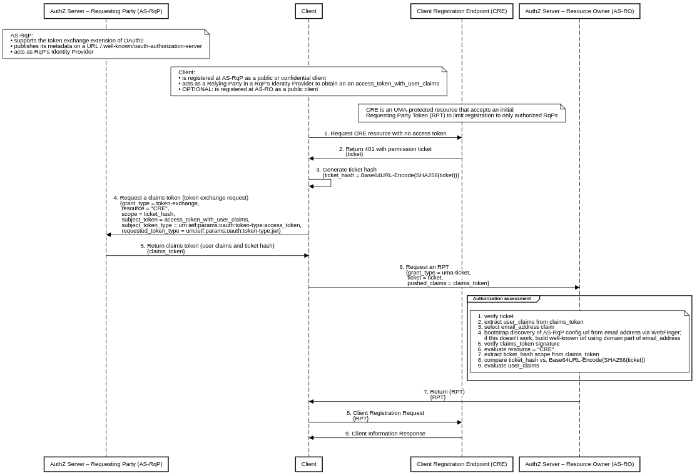

# UMA Dynamic Client Registration

This diagram shows how the resource owner's authorization server can protect its own client registration endpoint by using the Correlated Authorization protocol. An initial RPT is required when making registration requests. This allows the resource owner to manage each RqP's client separately.

Prerequisites:

* The AS-RqP supports the [OAuth 2.0 Token Exchange][5] extension of OAuth2.
* The AS-RqP also acts as RqP's Identity Provider.
* The AS-RqP publishes its metadata on a URL /.well-known/oauth-authorization-server (alternatively on /.well-known/openid-configuration).
* The client is registered at the AS-RqP as a public or confidential client and acts as a Relying Party in a RqP's Identity Provider to obtain an access token with user claims.
* OPTIONAL. The client is registered at the AS-RO as a public client – this is recommended for Single Page Applications.
* The CRE is an UMA-protected resource that accepts an initial RPT to limit registration to only authorized RqPs.

Steps:

1. The RqP directs the client to access the CRE resource with no access token.
2. Without an access token, the CRE will return HTTP code 401 (Unauthorized) with a permission ticket.
3. The client generates a ticket hash derived from the permission ticket using the following transformation ticket_hash = Base64URL-Encode(SHA256(ticket)).
4. At the AS-RqP the client requests a claims token by presenting the access token with user claims and the generated ticket hash.
5. The AS-RqP returns the claims token.
6. At the AS-RO the client requests an RPT by presenting the claims token and the permission ticket.
7. After an authorization assessment, it is positive, the AS-RO returns RPT.
8. With the valid RPT the client sends the registration request to the CRE.
9. The CRE validates the RPT, it is valid, the CRE returns the client information response.

If the client has been pre-registered at the RO's AS as a public client, then after the protected dynamic registration, the client is registered twice, both as a public and at the same time as a confidential client. When communicating with the AS, the client uses the registration that is more secure. If the client is a Single Page Application, the confidential registration identifier (nonce), which is mapped to the client credentials, has to be returned from the registration endpoint in the form of a cookie with the HttpOnly and Secure attributes set. If the RqP deletes the cookies or the confidential client registration has been removed from the server, the client may re-register with the RO's AS.

## Acknowledgment

Credits go to [WG - User-Managed Access][1].

[1]: https://kantarainitiative.org/confluence/display/uma/Home
